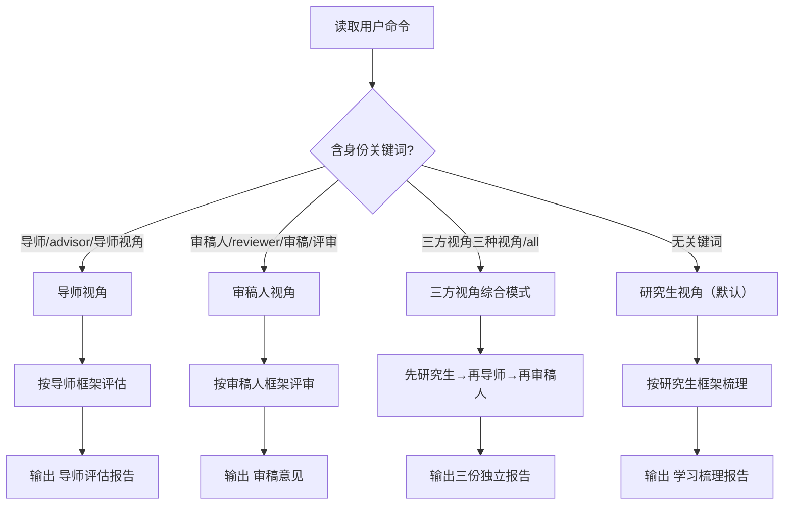

# math-pdf-read: 数学/经济学文献三方视角审阅

## SKILL_DIR 自动检测（runtime-neutral）

```bash
# 自动定位本 skill 目录（跨 Claude Code / OpenCode / DevEco Code / Codex 兼容）
SKILL_DIR=""
for base in "$HOME/.claude/skills" "$HOME/.config/opencode/skills" "$HOME/.config/deveco/skills" "$HOME/.codex/skills"; do
  found=$(find "$base" -maxdepth 2 -name "SKILL.md" -path "*/math-reference-read/SKILL.md" -exec dirname {} \; 2>/dev/null | head -1)
  if [ -n "$found" ]; then SKILL_DIR="$found"; break; fi
done
# fallback: 当前工作目录下的 math-reference-read/
if [ -z "$SKILL_DIR" ] && [ -d "math-reference-read" ]; then SKILL_DIR="math-reference-read"; fi
```

## 工作流概览


---

> **⚠️ Windows 编码兼容**：该 skill 的脚本和输出使用 UTF-8 编码。
> 如果在 Windows Git Bash 中执行时遇到 `UnicodeEncodeError: 'gbk' codec can't encode character`
> 错误，请在命令前加 `PYTHONIOENCODING=utf-8`：
> ```bash
> PYTHONIOENCODING=utf-8 python script.py ...
> ```
> 脚本内部已做编码修复，大部分情况下不需要手动加前缀。如果仍有问题，手动设置即可。

---

## 失败模式编码（嵌入工作流）

每步附带 if-then 三段式 fallback。原则：不假设环境完美，所有异常必须显式处理。

| 触发条件 | 一线修复 | 仍失败兜底 |
|---------|---------|-----------|
| MinerU token 未配置 | 友好引导创建 `~/.mineru/config.yaml` | 告知用户手动完成配置后重试 |
| PDF 解析超时（>5分钟） | 用 `--pages "1-20"` 分批处理 | 切换 `--model pipeline` 加速 |
| 文件 >200MB 或 >600 页 | 提示用户拆分文件 | 用 `--pages` 分页分批提取 |
| 扫描件导致 OCR 失败 | 增加 `--ocr` 参数 | 用 `--model html` 尝试不同解析引擎 |
| 网络请求失败 | 检查网络连接后重试 | 记录错误，告知用户稍后重试 |

## 第 1 步：检查 MinerU SDK 配置

> **🔴 CHECKPOINT**：在执行 PDF 提取前，先确认 MinerU SDK 已配置。未配置则引导用户完成配置，不要跳过此步直接执行。

**每次使用前必须检查 `~/.mineru/config.yaml` 是否存在且包含有效的 `token`。**

```python
import yaml
from pathlib import Path

config_path = Path.home() / ".mineru" / "config.yaml"
if config_path.exists():
    config = yaml.safe_load(config_path.read_text(encoding="utf-8"))
    token = config.get("token", "")
    if token:
        print("[OK] MinerU SDK token 有效 (len=%d)" % len(token))
    else:
        token = None
        print("[WARN] token 为空")
else:
    token = None
    print("[WARN] ~/.mineru/config.yaml 不存在")
```

### 如果未配置：

主动引导用户完成配置，**不要直接报错退出**。用友好语气告知：

> "使用 MinerU SDK 解析 PDF 需要配置 API Token。
>
> 请执行以下步骤：
>
> 1. 确保已安装 mineru-open-sdk：
>    ```bash
>    pip install mineru-open-sdk
>    ```
>
> 2. 创建配置文件：
>    ```bash
>    mkdir -p ~/.mineru
>    ```
>
> 3. 编辑 `~/.mineru/config.yaml`，写入：
>    ```yaml
>    token: '你的API密钥'
>    ```
>
> 4. 如果还没有密钥，请前往 https://mineru.net/apiManage/token 注册获取。
>
> 配置完成后重新运行即可。"

配置好后，继续执行后续步骤。

---

## 第 2 步：PDF → Markdown 转换（使用 mineru-open-sdk）

使用配套脚本 `scripts/math_pdf_extract.py` 完成转换。

### 单文件转换

```bash
# 方式一：直接执行（脚本内含编码修复，适用于大多数环境）
python "$SKILL_DIR/scripts/math_pdf_extract.py" \
  "path/to/paper.pdf" \
  --output-dir ./math-output

# 方式二：如果遇到 GBK 编码错误，加 PYTHONIOENCODING 前缀
PYTHONIOENCODING=utf-8 python "$SKILL_DIR/scripts/math_pdf_extract.py" \
  "path/to/paper.pdf" \
  --output-dir ./math-output
```

### ⚠️ 核心铁律：一份 PDF → 一个 .md → 一份审阅报告

**严禁将多份 PDF 的内容合并到同一个 `.md` 文件中。** 每份 PDF 必须拥有自己独立的 Markdown 文件和独立的结构化审阅报告。这是不可违背的规则。

### 批量多文件

用户一次提供多个 PDF 时，**逐份独立处理**：

1. 为每份 PDF 创建一个独立的输出文件夹（或使用清晰的文件名区分）
2. 每份 PDF 依次经历：转换 → 审阅 → 输出的完整流程
3. 每份 PDF 生成自己独立的：
   - `<文件名>.md`（MinerU 转换结果）
   - `<文件名>_审阅报告_研究生视角.md`（如为研究生视角）
   - `<文件名>_审阅报告_导师视角.md`（如为导师视角）
   - `<文件名>_审阅报告_审稿人视角.md`（如为审稿人视角）

**并发处理多个 PDF 时同样必须遵守这条规则**——每个并发分支各自处理自己的那一份 PDF，互不干扰，绝不混淆。

### 脚本参数说明

| 参数 | 默认值 | 说明 |
|------|--------|------|
| `--output-dir` | `./math-output` | 输出目录 |
| `--model` | `vlm` | 模型版本：`pipeline` / `vlm` / `html` |
| `--ocr` | 关闭 | 对扫描件启用 OCR |
| `--language` | `en` | 文档语言（数学/经济论文多为英文，默认 `en`） |
| `--no-formula` | 开启公式识别 | 禁用公式识别 |
| `--no-table` | 开启表格识别 | 禁用表格识别 |
| `--pages` | 全部 | 页码范围，如 `"1-10,15"` |

### 转换完成后的输出

脚本会在输出目录生成：
- `<文件名>.md` — 最终的 Markdown 文件（核心产物）

**每份 PDF 处理完毕，脚本自动调用本地日用量跟踪并报告当日用量。**

### 错误处理（三段式 fallback）

| 触发条件 | 一线修复 | 仍失败兜底 |
|---------|---------|-----------|
| Token 无效／未配置 | 引导用户配置 `~/.mineru/config.yaml` | 告知用户手动完成后重试 |
| 文件过大（>200MB） | 用 `--pages` 分批处理 | 拆分 PDF 为多个子文件 |
| 解析失败 | 检查 PDF 是否加密、损坏 | 扫描件启用 `--ocr` |
| 超时（>5分钟） | 用 `--pages "1-20"` 分批 | 切换 `--model pipeline` 加速 |

---

## 第 3 步：选择审阅身份（Perspective Selection）

> **🔴 CHECKPOINT**：审阅前确认身份选择是否正确：
> - 无关键词 → 研究生视角（默认）
> - "导师"关键词 → 导师视角
> - "审稿人"关键词 → 审稿人视角
> - 若用户意图不明确，暂停并向用户确认。

**这是 skill 的核心特性**——根据用户意图自动选择或手动切换审阅视角。

### 身份选择规则

| 触发条件 | 默认身份 | 手动切换命令 |
|---------|---------|------------|
| 用户未指定视角 | ✅ **研究生视角**（学习理解导向） | — |
| 命令中含"导师""导师视角""导师看""advisor" | — | `/math-pdf-read 导师视角` |
| 命令中含"审稿人""reviewer""审稿""评审" | — | `/math-pdf-read 审稿人视角` |
| 命令中含"三方视角""三种视角""all" | — | 依次输出三份报告 |
| 命令中含"切换身份"或"双身份" | — | 询问用户具体需求 |

### 身份判定流程

1. **解析用户输入**：检查用户消息中是否含有身份关键词
   - 研究生触发词：`研究生`、`student`、`学习`（或无关键词）
   - 导师触发词：`导师`、`advisor`、`指导`、`导师视角`
   - 审稿人触发词：`审稿人`、`reviewer`、`审稿`、`review`、`评审`、`审阅`、`评判`
   - 三方视角触发词：`三方`、`全部`、`三种`、`all`
2. **无关键词** → 默认使用 **研究生视角**
3. **有明确关键词** → 切换到对应身份
4. **用户要求三方视角** → 依次输出研究生视角报告 → 导师视角报告 → 审稿人视角报告，三份独立文件

---

## 第 3-A 步：研究生视角 — 文献学习理解

**适用场景**：课程作业、文献综述、开题报告、资格考试、自学理解

获取 Markdown 原文后，以**学习者**身份通读全文，按以下框架提取信息。目标是帮助用户**理解、消化和吸收**文献内容，尤其关注数学/经济学论文中的模型推导、实证方法和数据逻辑。

### 输出结构（研究生视角）

```markdown
# [文献标题]
> 📖 **分析身份：研究生视角** — 以学习理解为导向
> **领域标签**：[数学 / 经济学 / 计量经济学 / 金融学 / 统计学]

## 一、摘要（Abstract）
> 用 200-300 字精炼概括全文核心内容，包括研究背景、研究问题、方法、主要发现和结论。
> **注意**：这里不是简单地复制原文摘要，而是结合全文内容做综合提炼。
> 如果原文有英文摘要，保留中英双语对照。
> 对于数学/经济学论文，需点明核心模型或方法（如：DID、IV、DSGE、深度学习等）。

## 二、文献综述（Literature Review）
> 梳理作者引用的主要理论框架和前人研究：
> - 该研究的理论根基是什么？（如：博弈论、一般均衡、随机过程、优化理论等）
> - 引用了哪些关键文献和核心学者？
> - 作者指出的研究空白（research gap）是什么？
> - 与已有文献的关系：是拓展、反驳还是补充？
> - 对于初学者：推荐 2-3 篇该领域的必读文献作为延伸

## 三、研究问题（Research Questions）
> - 明确的罗列研究问题/假设（RQ1, RQ2, ...）
> - 对于经济学论文：是否有明确的理论假设或可检验假说？
> - 如果原文没有明确写出，根据研究目的推断并标注"（推断）"

## 四、研究方法（Research Methods）
> - **理论模型**（如有）：核心假设、模型设定、推导逻辑
> - **实证策略**（如有）：识别策略（IV / DID / RDD / 匹配 / 结构估计等）
> - **数据来源**：数据集名称、样本期间、样本量、数据来源
> - **关键变量**：因变量、核心自变量、控制变量
> - **识别假设**：排除性限制、平行趋势等关键假设是否合理
> - **稳健性检验**：安慰剂检验、替换变量、子样本等
> - 如果论文是纯数学理论：重点说明定理、证明思路、关键引理

## 五、研究结果（Research Results）
> - 主要发现（分点列出）
> - 核心数据/统计结果（引用关键系数、标准误、p 值等）
> - 与研究问题的对应关系
> - 效应的经济/数学显著性（而不仅仅是统计显著性）

## 六、讨论与评价
> - 作者对结果的解释是否合理
> - 研究局限性（从学习者角度诚实评估）
> - 对自己研究的启发：
>   - 哪些方法可以直接借鉴？
>   - 有哪些可能的拓展方向？
>   - 与自己的研究兴趣如何衔接？

## 七、关键公式与概念（可选）
> 列出文中的核心数学/经济公式及定义，帮助快速查阅。
```

---

## 第 3-B 步：导师视角 — 文献指导评估

**适用场景**：指导学生选文献、判断文献与学生研究的匹配度、快速判断是否值得精读

获取 Markdown 原文后，以**导师/advisor**身份对文献进行评估。目标是帮助用户**判断该文献的学术价值和指导意义**。

### 输出结构（导师视角）

```markdown
# [文献标题]
> 🎓 **分析身份：导师视角** — 以指导评估为导向
> **领域标签**：[数学 / 经济学 / 计量经济学 / 金融学 / 统计学]

## 一、文献定位（Literature Positioning）
> - **发表信息**：期刊/会议/工作论文，年份，作者
> - **领域归属**：属于哪个子领域？（微观/宏观/计量/金融数学/纯数学/应用数学等）
> - **学术影响**：引用量、是否顶刊、作者在该领域的声望
> - **难度评级**：⭐ 1-5（1=本科水平，5=前沿专家水平）
> - **创新程度**：⭐ 1-5（1=常规增量贡献，5=开创性突破）

## 二、研究问题与贡献评估
> - 研究问题是否重要？解决了什么实质性难题？
> - 主要贡献是什么？（理论创新 / 方法创新 / 实证创新）
> - 与领域内其他工作的关系是怎样的？
> - **值得关注的点**：这篇论文为什么值得读/不值得读？

## 三、方法论评估（适合指导的角度）
> - 方法选择是否合理、前沿？
> - 技术难度如何？学生需要什么先修知识才能理解？
>   - 先修课程：实分析/泛函分析/概率论/计量经济学/动态优化等
> - 可复现性如何？（代码和数据是否公开？）
> - **对学生阶段的评价**：
>   - 这篇文章适合哪个阶段的学生读？（本科论文 / 硕士 / 博士一年级 / 博士高年级）
>   - 学生可以从中学到什么核心技术？
>   - 如果要学生做类似研究，需要补什么短板？

## 四、结果可信度评估
> - 核心结论的稳健性如何？
> - 是否有潜在的内生性或识别问题？
> - 数值模拟/实证结果的可靠程度
> - 如果存在争议，争议点在哪里？

## 五、教学与指导建议
> - **推荐指数**：⭐ 1-5（1=不建议阅读，5=强烈推荐精读）
> - **建议的阅读方式**：
>   - 略读（只读摘要和结论）
>   - 精读（重点看方法和实证）
>   - 通读+推导（带着做复现）
> - **延伸材料**：建议同时阅读的配套文献
> - **值得讨论的点**：可以在组会上讨论的议题

## 六、对学生研究的启发
> - 这篇论文可以如何启发学生的研究选题？
> - 有哪些可行的拓展方向？
> - 如果学生想 follow 这条线，推荐什么切入点？
> - **警惕信号**：如果学生想模仿该研究，需要注意什么问题？
```

---

## 第 3-C 步：审稿人视角 — 同行评审评估

**适用场景**：期刊审稿、学位论文评阅、课题评审、质量评估

获取 Markdown 原文后，以**审稿人**身份对文献进行专业评估。目标是帮助用户**评判文献质量和贡献**，形成可提交的审稿意见。

### 核心立场

作为审稿人，你需要对文献做出**独立的专业判断**。重点关注：
- 研究的原创性（Originality）与贡献度
- 方法论的严谨性（Methodological Rigor）——对数学/经济论文尤为重要
- 识别假设与因果关系识别的合理性
- 论证逻辑的一致性（Argumentative Coherence）
- 证据的充分性（Evidential Sufficiency）
- 写作与呈现质量（Presentation Quality）

### 输出结构（审稿人视角）

```markdown
# 审稿意见：[文献标题]
> 🎯 **分析身份：审稿人视角** — 以评估评判为导向

## 一、总体评价（Overall Assessment）
> **推荐意见**：[接收 / 小修 / 大修 / 拒稿]
>
> **一句话总结**：用一句话概括本文的核心贡献和总体质量。
>
> **创新性评分**：⭐ 1-5
> **方法论评分**：⭐ 1-5
> **写作质量评分**：⭐ 1-5
>
> **综合推荐理由**：简要说明推荐意见的核心依据。

## 二、研究问题与创新性评估（Originality Assessment）
> - 研究问题是否明确、新颖、有意义？
> - 与已有文献的关系交代是否充分？
> - **核心贡献**是什么？是否存在实质性的理论/方法/实证推进？
> - 是否存在"宣称的创新"与"实际贡献"之间的落差？
> - 对于该领域而言，本文的价值和意义何在？

## 三、方法论评估（Methodological Review）
> - **模型设定**：假设是否合理？模型是否适切于研究问题？
> - **识别策略**（经济学论文重点）：
>   - 内生性问题是否得到妥善处理？
>   - 工具变量的排他性和相关性是否令人信服？
>   - DID 的平行趋势假设是否成立？
>   - RDD 的连续性假设是否合理？
> - **理论部分**（数学论文重点）：
>   - 定理证明是否严谨？是否存在逻辑漏洞？
>   - 关键引理的证明是否完整？
>   - 条件假设是否最弱/最优？
> - **数据和计算**：
>   - 样本量是否充足？数据来源是否可靠？
>   - 数值方法是否稳定？收敛性如何？
> - **关键缺陷**（如有）：指出方法论上的致命或重大瑕疵

## 四、论证与证据评估（Argument & Evidence）
> - 研究发现是否能充分支持结论？
> - 是否存在过度推论（overclaiming）或证据不足的情况？
> - 稳健性检验是否充分？替代解释是否得到考虑？
> - 论证链条是否存在断裂或逻辑跳跃？
> - 表格/图形的呈现是否清晰、无误导？

## 五、具体修改意见（Specific Comments）
> 按重要程度排序，逐条列出：
> 1. **[强制性修改]** 必须解决的问题
> 2. **[建议性修改]** 建议改进之处
> 3. **[细节修正]** 文字、格式、引用等细节问题
>
> 每条意见标注出现位置（页码/段落），并说明理由。

## 六、写作与呈现质量（Presentation）
> - 结构是否合理、逻辑清晰？
> - 数学符号和公式表示是否准确、规范？
> - 图表是否清晰、必要、自明？
> - 引用是否充分、准确、规范？

## 七、总结与建议（Summary & Recommendation）
> **最终推荐意见**：[接收 / 小修 / 大修 / 拒稿]
>
> **接收条件**（如为大修/拒稿）：明确说明需要满足哪些条件。
>
> **给编辑部的说明**（如适用）：简要、专业的内部评审意见。
>
> **给作者的建议**：建设性的改进方向，语气专业但不失尊重。
```

### 审稿人行为准则

1. **公正客观**：基于文献本身做出判断，不因个人偏好或学术流派偏见影响评价
2. **证据为本**：每条批评必须有具体依据，标注文献中的位置
3. **建设性**：负面评价必须伴随改进建议，避免单纯的否定
4. **区分等级**：明确区分"必须修改"和"建议修改"的界限
5. **识别亮点**：即使总体评价不高，也应指出文献的可取之处

---

## 第 3-D 步：三方视角综合模式

当用户要求"三方视角"时，依次执行以下流程：

1. **先**以研究生视角输出 `[文件名]_审阅报告_研究生视角.md`
2. **再**以导师视角输出 `[文件名]_审阅报告_导师视角.md`
3. **最后**以审稿人视角输出 `[文件名]_审阅报告_审稿人视角.md`
4. 三份文件各自独立保存

---

## 通用分析原则（三身份共享）

1. **忠实原文**：所有提取的信息必须有原文依据，不凭空杜撰
2. **专业深度**：使用数学/经济学领域的专业术语（而非泛泛的通用表述）
3. **结构清晰**：保持各自框架，便于后续导出和阅读
4. **中英双语**：尽量保留原文中的英文术语和表达式（如：Difference-in-Differences，Kernel 等）
5. **公式准确**：对于数学/经济学论文，关键公式和统计量必须准确引用

---

## 第 4 步：导出文件

### 默认行为：纯 Markdown 输出（无 PDF 编译）

本 skill **默认不编译 PDF**，仅输出 Markdown 格式的审阅报告。用户可以根据需要自行编译。

### 输出文件命名

| 身份 | 输出文件 |
|------|---------|
| 研究生视角（默认） | `[原PDF文件名]_审阅报告_研究生视角.md` |
| 导师视角 | `[原PDF文件名]_审阅报告_导师视角.md` |
| 审稿人视角 | `[原PDF文件名]_审阅报告_审稿人视角.md` |
| 三方视角 | 三份分别输出 |

例如：`高维计量经济学_审阅报告_研究生视角.md`

将输出保存在用户指定的目录，或与原 PDF 同目录下的 `math-output/` 子目录中。

### 如果用户需要 PDF

如果用户明确要求 PDF 格式，则检查 pandoc 可用性并尝试编译：

```bash
if command -v pandoc &>/dev/null; then
    pandoc "审阅报告.md" -o "审阅报告.pdf" --pdf-engine=xelatex --from markdown+smart
fi
```

---

## 完整处理流程（一次性全部执行）

### 身份判定流程图



### 单份 PDF 的标准流程

每份 PDF 独立经历以下完整链路，绝不交叉：

```bash
# ===== 处理 paper.pdf（单份） =====

# 1️⃣ 检查 MinerU SDK 配置
# 读取 ~/.mineru/config.yaml 中的 token

# 2️⃣ 转换 PDF → Markdown（只处理这一份）
python "$SKILL_DIR/scripts/math_pdf_extract.py" \
  "paper.pdf" --output-dir ./math-output

# 3️⃣ 读取生成的 Markdown 并做审阅分析
# 研究生视角 → 读取 ./math-output/paper.md，按 3-A 步框架梳理
# 导师视角   → 读取 ./math-output/paper.md，按 3-B 步框架评估
# 审稿人视角 → 读取 ./math-output/paper.md，按 3-C 步框架评审
# 三方视角   → 先后运行三遍

# 4️⃣ 将审阅结果保存为独立的 Markdown 文件
# 研究生视角 → ./math-output/paper_审阅报告_研究生视角.md
# 导师视角   → ./math-output/paper_审阅报告_导师视角.md
# 审稿人视角 → ./math-output/paper_审阅报告_审稿人视角.md

# ✅ paper.pdf 处理完毕
# 自动报告当日 API 用量
```

### 多份 PDF 的流程

```bash
# ===== 每份 PDF 独立处理，各自根据身份生成对应文件 =====

# paper1.pdf（研究生视角）→
#   math-output/paper1.md
#   math-output/paper1_审阅报告_研究生视角.md

# paper2.pdf（导师视角）→
#   math-output/paper2.md
#   math-output/paper2_审阅报告_导师视角.md

# paper3.pdf（三方视角）→
#   math-output/paper3.md
#   math-output/paper3_审阅报告_研究生视角.md
#   math-output/paper3_审阅报告_导师视角.md
#   math-output/paper3_审阅报告_审稿人视角.md
```

**再次强调：在任何情况下，一个 `.md` 文件都只对应一份 PDF 的内容，绝不混装。**

---

## 反例与黑名单（不要这样做）

| # | 反模式 | 后果 | 正确做法 |
|---|--------|------|---------|
| 1 | **跳过 MinerU token 检查直接执行** | 脚本报错，用户困惑 | 每次必须检查 `~/.mineru/config.yaml`，未配置则友好引导用户配置 |
| 2 | **多份 PDF 合并到同一个 `.md` 文件** | 内容混淆，审阅报告交叉污染 | 每份 PDF 独立提取→独立审阅→独立输出文件 |
| 3 | **审阅时凭空编造原文内容** | 报告不准确，误导用户 | 所有提取信息必须有原文依据，不确定时标注"（推断）" |
| 4 | **忽略 Windows GBK 编码兼容** | 终端报 `UnicodeEncodeError` | 命令前加 `PYTHONIOENCODING=utf-8` 前缀 |
| 5 | **审稿人视角用学习语气而非评估语气** | 输出软绵绵不像审稿意见 | 审稿人必须做到"独立的专业判断"，明确区分必需修改 vs 建议修改 |
| 6 | **超时后不提示用户改用 `--pages` 分批** | 大文件反复失败 | 超过 5 分钟超时时主动建议 `--pages "1-20"` 分批处理 |

---

## 日用量跟踪说明

**每次处理完一份 PDF，脚本会自动报告以下当日用量信息：**

```
📊 ── 当日 MinerU API 用量 ────────────────────
   已用页数:         12
   剩余可处理页数:    1988（日限额 2000 页）
   已处理文件数:      3
   📌 注: 超出限额后解析优先级会降低，但仍可继续使用
──────────────────────────────────────────────
```

- 数据记录在 `$SKILL_DIR/daily_usage.json`（按日期自动管理）
- 自动清理 30 天前的历史记录
- 日限额基于 MinerU 免费账号的 **2000 页/天** 标准
- 超出限额后不影响使用，只是解析优先级下降
- 此跟踪为**本地估算**，实际余额以 MinerU 官网控制台为准

### 日配额管理建议

| 操作 | 说明 |
|------|------|
| 查看今日用量 | `SKILL_DIR=...; python -c "import json; d=json.load(open(r'$SKILL_DIR/daily_usage.json')); print(d.get('$(date +%Y-%m-%d)', {}))"` 替换 `SKILL_DIR` 为实际路径 |
| 查看历史用量 | 直接查看 `daily_usage.json` 文件 |
| 重置统计 | 如果更换了 API Key，可手动删除 `daily_usage.json` 重置统计 |
| 换 Key 后 | 删除 `daily_usage.json` 重新开始计数 |

---

## 注意事项

### 依赖检查

```bash
# 检查 mineru-open-sdk
python3 -c "from mineru import MinerU; print('✅ mineru-open-sdk 可用')" || pip install mineru-open-sdk
```

### MinerU API 限制

- 单文件 ≤ 200MB，≤ 600 页
- 上传链接有效期 24 小时
- 解析结果文件保存 30 天
- 免费版 API 有调用频率限制，如遇限速请稍后重试

### Windows 编码经验

Windows Git Bash 的默认输出编码为 GBK，而 Python 脚本中的 UTF-8 字符（如 emoji、中文）输出到终端时报 `UnicodeEncodeError`。**脚本已内置编码修复**（设置 stdout/stderr 为 UTF-8），但如果错误仍然出现：

```bash
# 手动指定编码
PYTHONIOENCODING=utf-8 python script.py ...

# 或在 Bash 中设置别名持久化
alias python3="PYTHONIOENCODING=utf-8 python3"
```

> 🔍 **实测经验**（2026-06-15）：52 页 PDF 转换耗时约 3 分钟（含上传+解析+下载），日用量 52/2000 页。

### 路径说明

脚本的 `pdf_path` 和 `--output-dir` 参数：

- 支持**绝对路径**（推荐）：`C:/Users/xxx/paper.pdf` 或 `/c/Users/xxx/paper.pdf`
- 支持**相对路径**：相对于当前的**工作目录（cwd）**，而不是脚本所在目录
- 如果 Bash 的当前工作目录不是您预期的位置，请使用绝对路径避免混淆
- 输出目录默认 `./math-output`（即 `cwd/math-output`）

### 依赖检查

```bash
# 检查 mineru-open-sdk（Windows 上必须加编码前缀）
PYTHONIOENCODING=utf-8 python3 -c "from mineru import MinerU; print('mineru-open-sdk OK')" || pip install mineru-open-sdk
```

### 数学/经济学 PDF 特别说明

- 英文论文默认使用 `en` 语言参数
- 中文论文在调用脚本时添加 `--language ch`
- 含大量公式的论文保留默认的公式识别（`--no-formula` 未设置时开启）
- 扫描件/图片 PDF 需要启用 `--ocr`，但会增加处理时间
 - 经济学实证论文通常页码较多，注意 MinerU 600 页的限制

---

## 代码注释规范 / Code Comment Standards

本 skill 内的脚本遵循以下平台特定注释规范, 确保可维护性与交互式帮助质量。

### ① Python (reST/Sphinx docstring 风格)

所有公有函数必须包含 reST 风格 docstring, 覆盖:

| 要素 | 要求 |
|------|------|
| 单行摘要 | 首行描述函数功能, 句号结尾 |
| 详细描述 | 空行后解释边界情况、算法逻辑 |
| `:param` | 参数名、类型、含义, 可选参数标注默认值 |
| `:return:` / `:rtype:` | 返回值语义及类型 |
| `:raises:` | 可能抛出的异常及条件 |
| `Example::` | doctest 风格调用示例 (可选但推荐) |

示例见 `scripts/math_pdf_extract.py` 中各函数 docstring。

### ② MATLAB (H1 行 + help 注释块)

当本 skill 未来包含 MATLAB 脚本时, 遵循以下规范:

- **H1 行**: 函数名大写开头 + 简短描述 (供 `lookfor` 索引)
- **语法块 (Syntax)**: 所有调用签名, 使用全大写占位符
- **输入参数表**: 数据类型 + 维度 + 含义
- **输出参数表**: 返回值结构与说明
- **异常处理 (Error Handling)**: 定义错误 ID
- **示例 (Examples)**: 命令行调用示例

### ③ LaTeX (TikZ/pgfplots 宏参数注释)

当本 skill 未来包含 LaTeX 排版脚本时:

- **文件头声明**: 用途 / 依赖宏包 / 版本
- **宏参数说明**: 写明 `#1` `#2` 含义及默认值
- **键值对参数表**: 列出所有可用 key
- **长文档分隔线**: `% ===` 分节
- **复杂表格/公式 inline 注释**: 解释数据来源和单位

---

## 图表生成规范 / Chart Generation Standards (前瞻)

本 skill 默认不生成图表, 但若审阅过程中需要可视化 (如统计分布图、对比柱状图等),
输出应遵循以下多平台代码规范:

### 必选平台

| 平台 | 目录 | 说明 |
|------|------|------|
| Python | `code/python/plot_*.py` | matplotlib/seaborn, 固定种子, reST docstring |
| LaTeX | `code/latex/plot_*.tex` | TikZ/pgfplots 出版级矢量图, 宏参数注释 |

### 可选平台

| 平台 | 目录 | 说明 |
|------|------|------|
| MATLAB | `code/matlab/plot_*.m` | H1 行 + help 注释块 |
| Tableau | `code/tableau/plot_*.twb` | 工作簿 / 数据驱动 |

### 区域标记注释

图表源码中每个视觉元素前标注 `# [A]` / `% [A]` 区域标记,
与图表上的标注一一对应, 便于审阅者反查代码段:

```
区域标记 [A][B][C]...  →  图表 PDF 上的标注字母  →  源码中的标记注释
```

---

## 后处理: 自动更新 / Post-Processing: Auto-Update

每次任务完成后, 自动检测本 skill 的 GitHub 仓库更新。

### 执行位置

文献审阅流程结束、向用户展示结果时一并输出更新信息。

### 流程

P.1 **版本检测**: 读取本地 `VERSION` → GET `raw.githubusercontent.com/.../VERSION` → 一致则跳过

P.2 **更新执行**: 下载 ZIP → 解压 → 覆盖 skill 目录 → 写入新 VERSION

P.3 **更新亮点**: GitHub API Compare → 提取 commits 格式化为 bullet list

P.4 **失败处理**: 网络不可达→静默跳过; 下载失败→保留旧版; 均不影响本次任务结果

### 执行脚本

```bash
powershell -ExecutionPolicy Bypass -File "$SKILL_DIR/scripts/auto_update.ps1"
```

---

<!-- 反例补充 -->
| # | 反模式 | 后果 | 正确做法 |
|---|--------|------|---------|
| 7 | 生成可视化图表时不导出生成代码 | 图表无法独立复现 | 每张图附带 Python+LaTeX 双平台代码 (`code/{python,latex}/plot_*`), 含 docstring + [A][B] 区域标记 |
